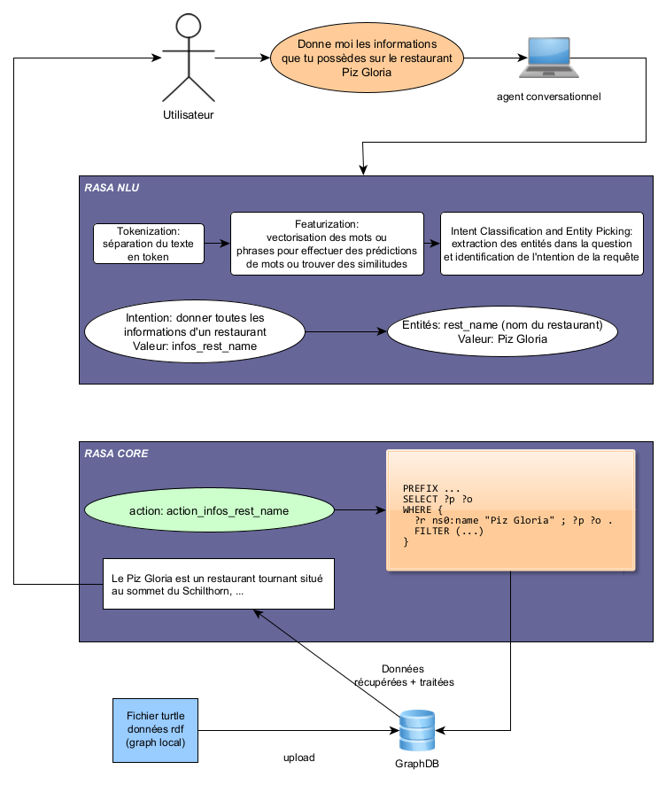

# Rasa knowledge graph bot

Construction d'un chat bot connecté à un graphe de connaissances avec la framework Rasa Open Source.

Ce travail a été réalisé dans le cadre de mon travail de bachelor en Système d'information et science des services à l'université de Genève.

## But du chatbot

Le but du chatbot est de renseigner les utilisateurs sur les restaurants en Suisse. Le chatbot peut répondre aux questions suivantes :

* Donner la liste des restaurants en Suisse.
* Donner toutes les informations concernant un restaurant en mentionnant son nom ou en utilisant des mentions tels que le  *premier* , le  *deuxième* , etc. Le chatbot donne éventuellement les lieux qui sont proches d'un restaurant.
* Lister quelques curiosités qui sont autour d'un restaurant (précisement les terrains de jeux) se trouvant à une distance maximale de  *1km*.
* Lister les restaurants par type de cuisine dans une ville.
* Le chatbot peut éventuellement résoudre quelques ambiguïtés, par exemple lorsque plusieurs restaurants ont le même nom.

**NB**: utiliser des chiffres lorsque le chatbot utilise l'adverbe `combien`

**Important**: ***le chatbot devient intélligent à travers les questions posées par l'utilisateur. Par exemple lorsqu'il n'a pas encore parcouru les restaurants d'une ville ou les restaurants qui offrent certaines spécialités dans une ville.***

## Fonctionnement du chatbot



Cette figure illustre de manière simpliste le fonctionnement du chatbot.

## Lancement du projet

Le projet à été déployé sur la plateforme [DigitalOcean](https://www.digitalocean.com/ "fournisseur cloud")  et est accessible à l'adresse suivante: http://165.232.106.190:5000/.

Pour lancer le projet en local ***sans docker***, suivre les étapes suivantes:

* Cloner le repositoire git.
* Créer un environnement virtuel qui contiendra toutes les dépendances du projet: `python -m venv env`
* Installer rasa: `pip install rasa`. Voir la docmentation officielle de l'installation de rasa: https://rasa.com/docs/rasa/installation/installing-rasa-open-source/
* Installer les dépendances se trouvant dans le folder *code/actions*: `pip install -r requirements-actions.txt `
* Entrainer le model avec la commande: `rasa train`.
* Installer [graphdb](https://graphdb.ontotext.com/ "graphdb"), puis créer un repositoire ayant le nom `POC-1`  et importer le fichier `restInswitzerland.ttl` se trouvant dans le dossier *code/data.*
* Lancer le serveur rasa: `rasa run --enable-api --cors='*'`
* Lancer le serveur d'actions: `rasa run actions`
* Avant de lancer l'application flask, assurez-vous que vous avez [flask](https://flask.palletsprojects.com/en/2.3.x/installation/ "flask") installer dans votre environnement virtuel.
* Lancer l'application flask:

  ```
  SET FLASK_APP=app.py
  flask run
  ```

**Important**: pour que le projet puisse fonctionner en local sans l'utilisation de docker. Il est primordial de remplacer le nom des conteneurs docker par `localhost`.  Par exemple dans le fichier *endpoints.yml* pour la connection vers le serveur d'action, remplacer `http://action_server:5055/webhook` par `http://localhost:5055/webhook`. L'url de connection à graphdb, et au serveur rasa depuis l'application flask (fichier `home_page.html`) devra être changé.

Pour lancer le projet avec docker (docker compose) suivre les étapes suivantes:

* Lancer la commande: `docker compose up --build` afin de lancer les différents services.
* Aller à l'adresse http://localhost:7200 puis importer le fichier` restInswitzerland.ttl` dans un repositoire nommé `POC-1`
